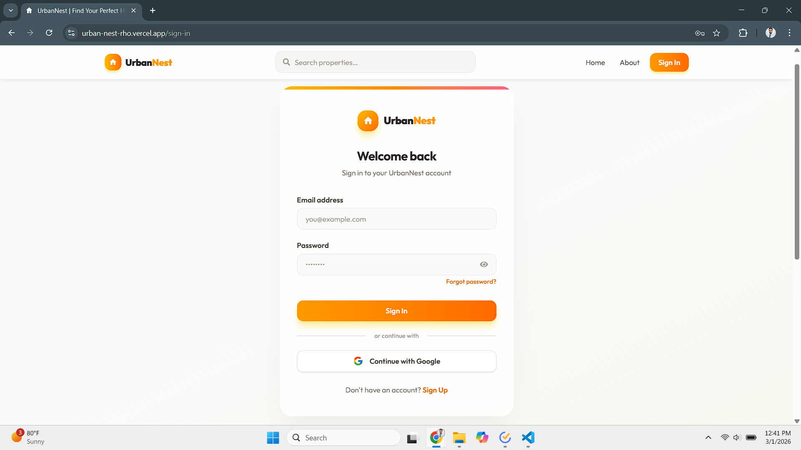
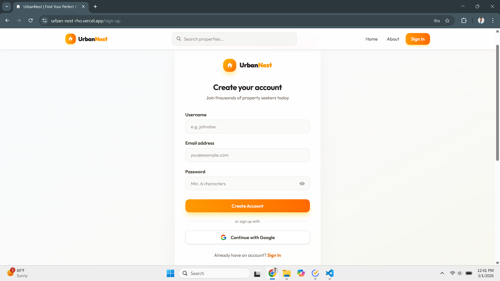
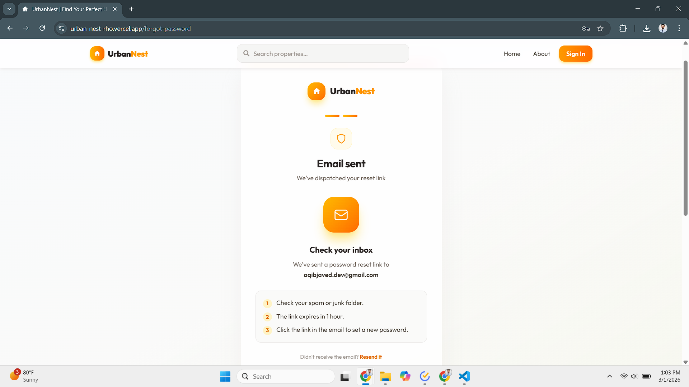
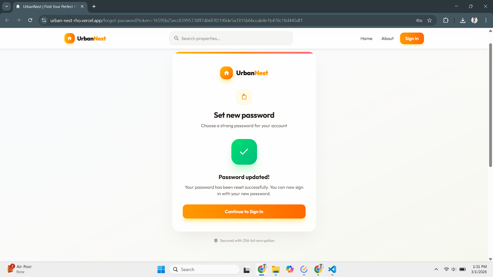
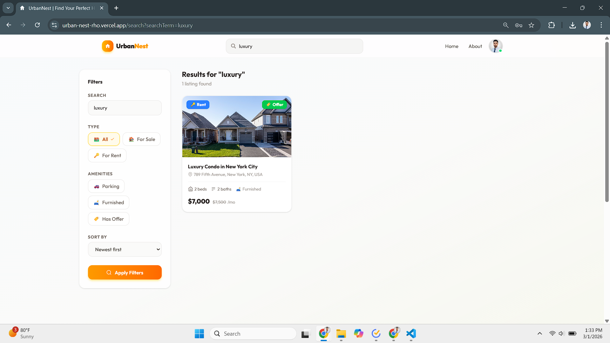
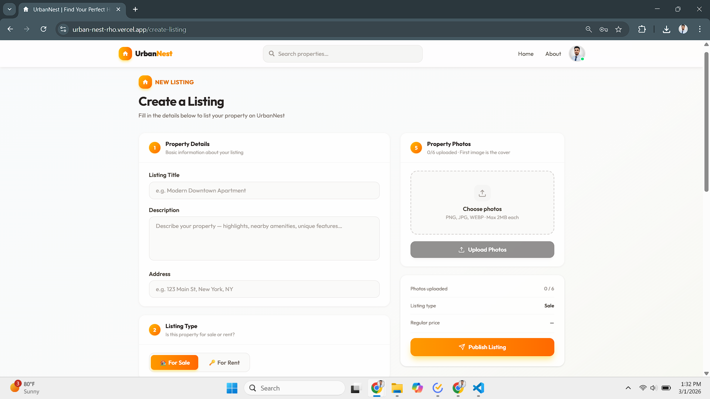
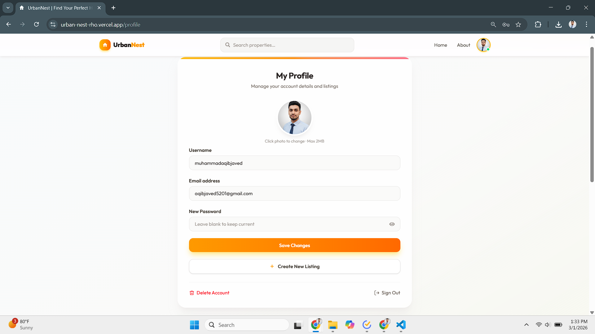

<div align="center">

# 🏠 UrbanNest — Real Estate Marketplace

**A full-stack real estate web application to discover, list, and connect on premium property rentals and sales. Built with the MERN stack and a luxury amber/orange design system.**

[](https://urban-nest.vercel.app)
[](https://urban-nest-api.vercel.app)
[](https://react.dev)
[](https://nodejs.org)
[](LICENSE)

</div>

---

## 📌 Table of Contents

- [Overview](#-overview)
- [Screenshots](#-screenshots)
- [How It Works](#-how-it-works)
- [Tech Stack](#-tech-stack)
- [Project Structure](#-project-structure)
- [Getting Started](#-getting-started)
- [Environment Variables](#-environment-variables)
- [API Reference](#-api-reference)
- [Deployment](#-deployment)
- [Contributing](#-contributing)

---

## 🧭 Overview

UrbanNest is a production-grade real estate marketplace where users can browse properties for sale or rent, post their own listings with photo galleries, and contact landlords directly. It features JWT + Google OAuth authentication, a secure forgot-password flow, Cloudinary image hosting, and a full search/filter engine.

| Feature | Detail |
|---|---|
| 🔐 Auth | JWT cookies + Google OAuth via Firebase |
| 🔑 Password Reset | Email token (SHA-256 hashed, 1-hour expiry) |
| 🏘️ Listings | Full CRUD with up to 6 Cloudinary-hosted photos |
| 🔎 Search | Filter by type, offer, parking, furnished + sort + pagination |
| 🎨 UI | Tailwind CSS 4, Swiper carousels, skeleton loaders, amber gradient system |
| 📱 Responsive | Mobile, tablet, and desktop |

---

## 📸 Screenshots

### 🏡 Home Page
> Animated hero, Swiper carousel with featured listings, stats bar, and CTA sections.


---

### 🔐 Sign In & Sign Up




---

### 🔑 Forgot Password
> Three-step flow — enter email → check inbox → set new password.

| Step 1 | Step 2 | Step 3 |
|--------|--------|--------|
|  |  |  |  |

---

### 🔎 Search & Listings




---

### ➕ Create & Edit Listing




---

### 👤 Profile & About




---

## ⚙️ How It Works

```
User browses / searches listings
          │
          ▼
React Frontend (Vite + Tailwind CSS 4)
          │  REST API calls via Axios
          ▼
Express REST API  ──▶  verifyToken middleware (JWT from cookie)
          │
          ▼
MongoDB (Mongoose)  ──  User / Listing models
          │
          ▼
Cloudinary (images)  ·  Firebase (Google OAuth)  ·  Nodemailer (reset emails)
          │
          ▼
JSON response  ──▶  Redux store updated  ──▶  UI re-renders
```

### Forgot Password Flow

```
POST /api/auth/forgot-password  ──▶  crypto.randomBytes(32)  ──▶  SHA-256 hash stored in DB
          │
Nodemailer sends  /forgot-password?token={rawToken}  to user's email
          │
POST /api/auth/reset-password   ──▶  SHA-256(rawToken) matched  ──▶  expiry checked
          │
bcrypt.hash(newPassword)  ──▶  saved  ──▶  token fields cleared
```

---

## 🛠️ Tech Stack

### Frontend

| Technology | Purpose |
|---|---|
| React 18 | UI library |
| Vite | Build tool & dev server |
| Tailwind CSS 4 | Utility-first styling |
| Redux Toolkit + Persist | Global state + persistence |
| React Router v6 | Client-side routing |
| Axios | HTTP client with credentials |
| Swiper.js | Touch-ready carousels |
| React Toastify | Toast notifications |

### Backend

| Technology | Purpose |
|---|---|
| Node.js + Express | REST API |
| MongoDB + Mongoose | Database + ODM |
| JSON Web Tokens | Stateless authentication |
| bcryptjs | Password hashing |
| Nodemailer | Password reset emails |
| Cloudinary | Image hosting & CDN |
| Firebase Admin | Google OAuth verification |

---

## 📁 Project Structure

```
urban-nest/
│
├── client/                        ← React Frontend (Vite)
│   └── src/
│       ├── components/            # Button, InputField, PasswordField,
│       │                          # OAuth, Navbar, Footer, ListingCard
│       ├── pages/                 # Home, SignIn, SignUp, ForgotPassword,
│       │                          # Profile, Search, Listing,
│       │                          # CreateListing, UpdateListing, About
│       ├── store/user/            # Redux userSlice
│       ├── config/                # Axios instance + all API endpoints
│       └── util/notify.js         # React Toastify helpers
│
├── server/                        ← Express Backend
│   ├── controller/
│   │   ├── auth.controller.js     # signup, signin, google, signout,
│   │   │                          # forgotPassword, resetPassword
│   │   ├── user.controller.js     # update, delete, getUser, listings
│   │   └── listing.controller.js  # CRUD + search/filter
│   ├── models/
│   │   ├── user.model.js          # incl. resetPasswordToken fields
│   │   └── listing.model.js
│   ├── routes/                    # auth, user, listing routers
│   └── middleware/auth.middleware.js  # verifyToken
│
├── docs/screenshots/              ← Add your screenshots here
└── README.md
```

---

## 🚀 Getting Started

### Prerequisites

```bash
node -v   # v18+
npm -v    # v9+
```

You also need accounts at [MongoDB Atlas](https://mongodb.com/atlas), [Firebase](https://console.firebase.google.com), and [Cloudinary](https://cloudinary.com).

---

### 1. Clone the repo

```bash
git clone https://github.com/your-username/urban-nest.git
cd urban-nest
```

### 2. Install dependencies

```bash
# Backend
cd server && npm install

# Frontend
cd ../client && npm install
```

### 3. Add environment variables

See [Environment Variables](#-environment-variables) below.

### 4. Add reset token fields to User model

```js
// server/models/user.model.js — add to your schema:
resetPasswordToken:   { type: String, default: undefined },
resetPasswordExpires: { type: Date,   default: undefined },
```

### 5. Run

```bash
# Backend  →  http://localhost:3000
cd server && npm run dev

# Frontend  →  http://localhost:5173
cd client && npm run dev
```

---

## 🔑 Environment Variables

### `server/.env`

```env
MONGO_URI=mongodb+srv://<user>:<pass>@cluster.mongodb.net/urban-nest
JWT_SECRET=your_jwt_secret
NODE_ENV=development

EMAIL_HOST=smtp.gmail.com
EMAIL_PORT=587
EMAIL_USER=your@gmail.com
EMAIL_PASS=your-gmail-app-password
CLIENT_URL=http://localhost:5173
```

> **Gmail:** Generate an **App Password** at myaccount.google.com → Security → App Passwords.

### `client/.env`

```env
VITE_WEBSITE_BASE_URL=http://localhost:3000
VITE_FIREBASE_API_KEY=AIza...
VITE_FIREBASE_AUTH_DOMAIN=your-project.firebaseapp.com
VITE_FIREBASE_PROJECT_ID=your-project
VITE_FIREBASE_STORAGE_BUCKET=your-project.appspot.com
VITE_FIREBASE_MESSAGING_SENDER_ID=123456789
VITE_FIREBASE_APP_ID=1:123456789:web:abc123
```

---

## 📡 API Reference

Base URL (production): `https://urban-nest-api.vercel.app`

### Auth — `/api/auth`

| Method | Endpoint | Auth | Description |
|--------|----------|:----:|-------------|
| `POST` | `/signup` | ❌ | Register with username, email, password |
| `POST` | `/signin` | ❌ | Sign in, sets JWT cookie |
| `POST` | `/google` | ❌ | Google OAuth sign in / register |
| `POST` | `/signout` | ✅ | Clear auth cookie |
| `POST` | `/forgot-password` | ❌ | Send password reset email |
| `POST` | `/reset-password` | ❌ | Set new password using token |

### Users — `/api/user`

| Method | Endpoint | Auth | Description |
|--------|----------|:----:|-------------|
| `GET` | `/get-user/:id` | ✅ | Get user profile |
| `POST` | `/upload-avatar` | ✅ | Upload profile photo |
| `PUT` | `/update-user/:id` | ✅ | Update account details |
| `DELETE` | `/delete-user/:id` | ✅ | Delete account |
| `GET` | `/user-listings/:id` | ✅ | Get user's listings |

### Listings — `/api/listing`

| Method | Endpoint | Auth | Description |
|--------|----------|:----:|-------------|
| `POST` | `/create-listing` | ✅ | Create listing |
| `GET` | `/get-listing/:id` | ❌ | Get single listing |
| `PUT` | `/update-listing/:id` | ✅ | Update listing (owner only) |
| `DELETE` | `/delete-listing/:id` | ✅ | Delete listing (owner only) |
| `GET` | `/get-listings` | ❌ | Search with filters |

**Search query params:** `searchTerm` · `type` · `offer` · `parking` · `furnished` · `sort` · `order` · `startIndex` · `limit`

---

## ☁️ Deployment

Both services deploy to **Vercel**.

| Service | Root Directory | Framework |
|---------|---------------|-----------|
| Frontend | `client/` | Vite |
| Backend | `server/` | Node.js |

### Production checklist

- [ ] Set `NODE_ENV=production` on backend
- [ ] Update `CLIENT_URL` to your Vercel frontend URL
- [ ] Add your Vercel domain to Firebase Authorized Domains
- [ ] Set JWT cookie `secure: true`, `sameSite: 'none'`

---

## 🤝 Contributing

1. Fork the repository
2. Create your branch — `git checkout -b feature/your-feature`
3. Commit — `git commit -m 'feat: add your feature'`
4. Push — `git push origin feature/your-feature`
5. Open a Pull Request

---

## 👨‍💻 Author

**Your Name**

[](https://github.com/AqibNiazi)

---

## 📄 License

This project is licensed under the MIT License — see the [LICENSE](LICENSE) file for details.

---

<div align="center">

Built with ❤️ for learning and development.

**If this project helped you, consider giving it a ⭐ on GitHub!**

</div>