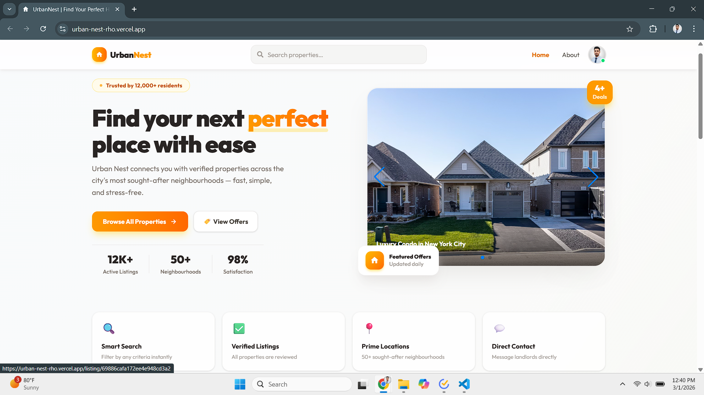
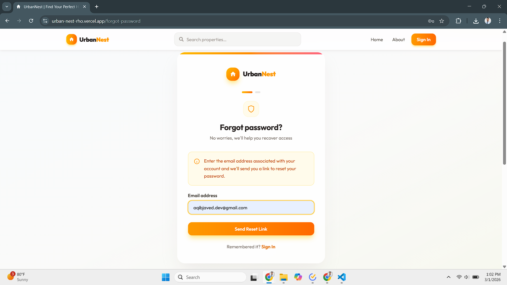
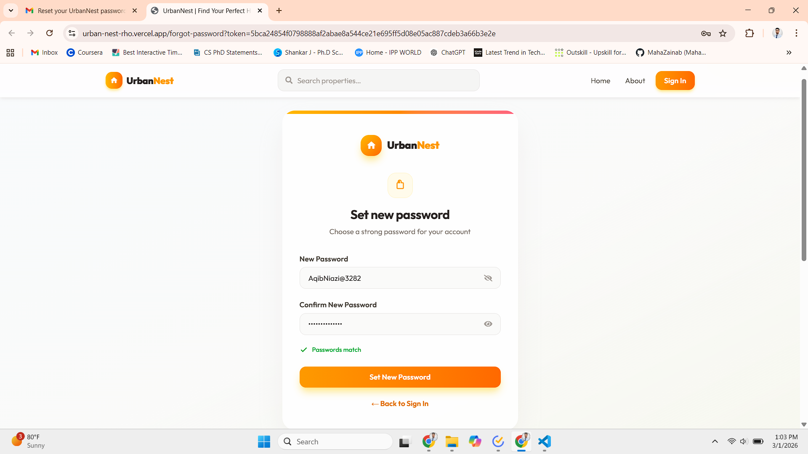
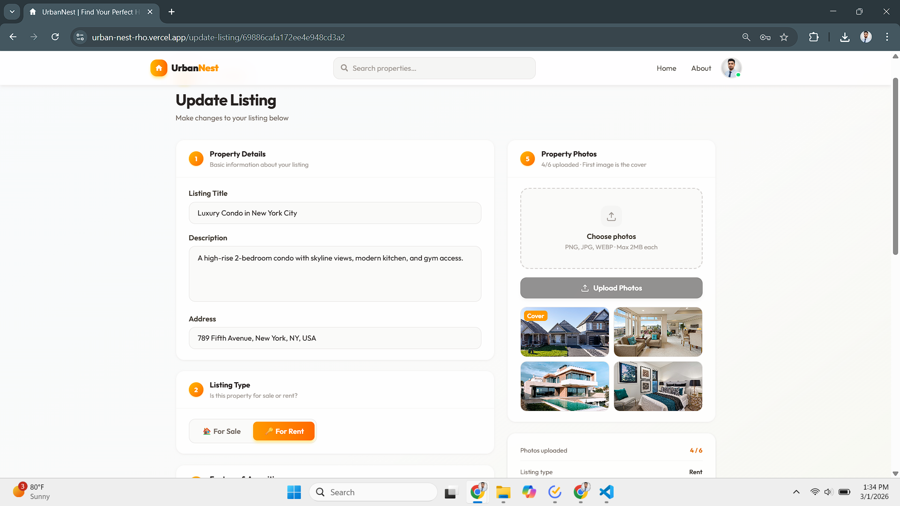
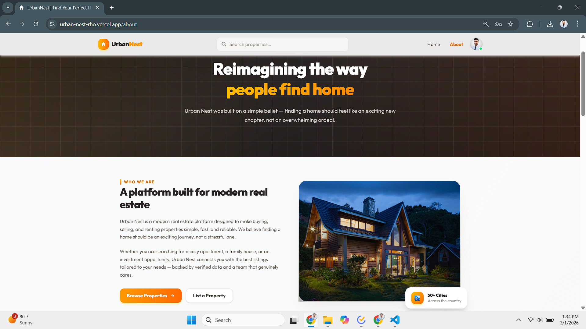

<div align="center">


# 🏠 UrbanNest — Real Estate Marketplace

**A full-stack real estate marketplace to discover, list, and manage property rentals and sales.**
**Built with the MERN stack, JWT authentication, and a premium amber/orange design system.**

[](https://urban-nest-rho.vercel.app)
[](https://github.com/AqibNiazi/urban-nest)
[](https://react.dev)
[](https://nodejs.org)
[](LICENSE)

</div>


## 📌 Table of Contents

- [Overview](#-overview)
- [Screenshots](#-screenshots)
- [Tech Stack](#-tech-stack)
- [Getting Started](#-getting-started)
- [Environment Variables](#-environment-variables)
- [API Reference](#-api-reference)
- [Deployment](#-deployment)


## 🧭 Overview

UrbanNest is a production-grade real estate marketplace where users can browse properties for sale or rent, post listings with photo galleries, and contact landlords directly. Built to strengthen full-stack development skills — with a focus on secure authentication, RESTful API design, and cloud service integration.

| Feature | Detail |
|---|---|
| 🔐 Authentication | JWT (HTTP-only cookies) + Google OAuth via Firebase |
| 🔑 Password Reset | 3-step email flow — SHA-256 hashed token, 1-hour expiry |
| 🏘️ Listings | Full CRUD with up to 6 Cloudinary-hosted photos per listing |
| 🔎 Search & Filter | Filter by type, offer, parking, furnished · sort · pagination |
| 📱 Responsive | Mobile, tablet, and desktop |


## 📸 Screenshots

### 🏡 Home Page




### 🔐 Sign In & Sign Up

| Sign In | Sign Up |
|---------|---------|
|  |  |


### 🔑 Forgot Password — 3-Step Flow

| Step 1 — Enter Email | Step 2 — Check Inbox | Step 3 — Set New Password |
|---|---|---|
|  |  |  |


### 🔎 Search & Listing Detail

| Search 
|--------|---------------|
|  | 


### ➕ Create & Edit Listing

| Create | Update |
|--------|--------|
|  |  |


### 👤 Profile & About

| Profile | About |
|---------|-------|
|  |  |


## 🛠️ Tech Stack

| Layer | Technologies |
|---|---|
| **Frontend** | React 19, Vite, Tailwind CSS 4, Redux Toolkit + Persist, React Router v7, Swiper.js, Axios |
| **Backend** | Node.js, Express, MongoDB, Mongoose, JWT, bcryptjs |
| **Services** | Firebase (Google OAuth) · Cloudinary (image CDN) · Nodemailer (emails) |
| **Deployment** | Vercel (frontend + backend) |


## 🚀 Getting Started

### Prerequisites

- Node.js v18+ and npm v9+
- Accounts at [MongoDB Atlas](https://mongodb.com/atlas), [Firebase](https://console.firebase.google.com), and [Cloudinary](https://cloudinary.com)

### Setup

```bash
# 1. Clone the repo
git clone https://github.com/AqibNiazi/urban-nest.git
cd urban-nest

# 2. Install backend dependencies
cd server && npm install

# 3. Install frontend dependencies
cd ../client && npm install

# 4. Add .env files (see Environment Variables below)

# 5. Run backend → http://localhost:3000
cd server && npm run dev

# 6. Run frontend → http://localhost:5173
cd ../client && npm run dev
```

> Add `resetPasswordToken` and `resetPasswordExpires` fields to your User schema — see [`user.model.js`](server/models/user.model.js).


## 🔑 Environment Variables

### `server/.env`

```env
MONGO_URI=mongodb+srv://<user>:<pass>@cluster.mongodb.net/urban-nest
JWT_SECRET=your_jwt_secret
NODE_ENV=development
EMAIL_HOST=smtp.gmail.com
EMAIL_PORT=587
EMAIL_USER=your@gmail.com
EMAIL_PASS=your-gmail-app-password
CLIENT_URL=http://localhost:5173
```

> For Gmail, generate an **App Password** at myaccount.google.com → Security → App Passwords.

### `client/.env`

```env
VITE_WEBSITE_BASE_URL=http://localhost:3000
VITE_FIREBASE_API_KEY=AIza...
VITE_FIREBASE_AUTH_DOMAIN=your-project.firebaseapp.com
VITE_FIREBASE_PROJECT_ID=your-project
VITE_FIREBASE_STORAGE_BUCKET=your-project.appspot.com
VITE_FIREBASE_MESSAGING_SENDER_ID=123456789
VITE_FIREBASE_APP_ID=1:123456789:web:abc123
```


## 📡 API Reference

### Auth — `/api/auth`

| Method | Endpoint | Auth | Description |
|--------|----------|:----:|-------------|
| `POST` | `/signup` | ❌ | Register new user |
| `POST` | `/signin` | ❌ | Sign in, sets JWT cookie |
| `POST` | `/google` | ❌ | Google OAuth |
| `POST` | `/signout` | ✅ | Clear auth cookie |
| `POST` | `/forgot-password` | ❌ | Send reset email |
| `POST` | `/reset-password` | ❌ | Set new password via token |

### Users — `/api/user`

| Method | Endpoint | Auth | Description |
|--------|----------|:----:|-------------|
| `GET` | `/get-user/:id` | ✅ | Get user profile |
| `POST` | `/upload-avatar` | ✅ | Upload profile photo |
| `PUT` | `/update-user/:id` | ✅ | Update account |
| `DELETE` | `/delete-user/:id` | ✅ | Delete account |
| `GET` | `/user-listings/:id` | ✅ | Get user's listings |

### Listings — `/api/listing`

| Method | Endpoint | Auth | Description |
|--------|----------|:----:|-------------|
| `POST` | `/create-listing` | ✅ | Create listing |
| `GET` | `/get-listing/:id` | ❌ | Get single listing |
| `PUT` | `/update-listing/:id` | ✅ | Update (owner only) |
| `DELETE` | `/delete-listing/:id` | ✅ | Delete (owner only) |
| `GET` | `/get-listings` | ❌ | Search with filters |

**Search params:** `searchTerm` · `type` · `offer` · `parking` · `furnished` · `sort` · `order` · `startIndex` · `limit`

## ☁️ Deployment

Both services are deployed on Vercel as separate projects.

| Service | Root Directory | Framework |
|---------|---------------|-----------|
| Frontend | `client/` | Vite |
| Backend | `server/` | Node.js |

**Production checklist:**
- [ ] Set `NODE_ENV=production` on backend
- [ ] Update `CLIENT_URL` to your frontend Vercel URL
- [ ] Add Vercel domain to Firebase Authorized Domains
- [ ] Set JWT cookie `secure: true`, `sameSite: 'none'`
- [ ] Add `vercel.json` in `client/` to fix React Router on direct URL visits

```json
{ "rewrites": [{ "source": "/(.*)", "destination": "/index.html" }] }
```


## 👨‍💻 Author

**Aqib Niazi** — Full Stack Engineer

[](https://github.com/AqibNiazi)
[](https://www.linkedin.com/in/maqibjaved/)


## 📄 License

MIT — see [LICENSE](LICENSE) for details.


<div align="center">

If this project helped you, consider giving it a ⭐

</div>